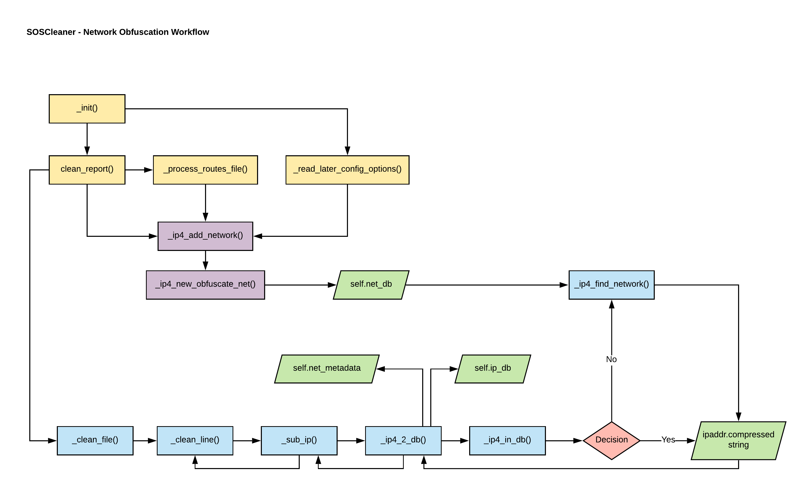

.. sectionauthor:: Jamie Duncan <jamie.e.duncan@gmail.com>

====================
Network Obfuscation
====================

Network Obfuscation Overview
-----------------------------
Beginning with version 0.3.0, soscleaner uses the ipaddr module to manage network objects and their obfuscation
This will let the program be much more intelligent with how it obfuscates the data while being network away, etc.

Filing networking bugs
```````````````````````
Please open networking obfuscation bugs using the :github_issues_url:`network obfuscation bug template <new?assignees=&labels=Exception+Engine%2C+network+obfuscation&template=networking-bug-.md&title=>`. This will ensure the proper labels are applied and we can move forward quickly with your issue.



  Network Obfuscation Workflow Overview

IPv4 Network database
----------------------

Each entry in ``self.net_db`` represents a network and its obfuscated value. ``self.net_db`` is a list of tuples. Each tuple has the following format::

    (original_network, obfuscated_network)

For each entry in ``self.net_db``, ``x[0]`` is the original network as an ``ipaddr.IPv4Network`` object
and ``x[1]`` is the obfuscated network as an ``ipaddr.IPv4Network`` object.

IPv4 address database
----------------------

Each entry in ``self.ip_db`` represents a found IP address and its obfuscated value as a key/value pair.

Obfuscating IPv4 addresses
---------------------------
When ``self.clean_report is run``, it populates ``self.net_db`` with the networks found in an sosreports routing table as well as with any networks specified using the ``-n`` command line parameter.

Each time an IP is found in a file, it will be compared against the values in ``self.net_db`` to determine its parent network. The IP is then obfuscated sanely with fidelity to the subnet and relative network space. The obfuscated value for that IP address is then either retrieved from ``self.ip_db``, or added to the database if it hasn't been obfuscated previously.

If an IP address is matched that doesn't exist in any other network, it will be obfuscated using an address from ``self.default_net``.
``self.default_net`` is the first obfuscated network created when soscleaner is run.

.. admonition:: Multicast obfuscation

  Soscleaner doesn't obfuscate multicast addresses to other multicast address spaces because of the limitations without that IPv4 space. They are, however, obfuscated to a unique network so they can still be tracked and used for troubleshooting issues.

IPv4 metadata
--------------
``self.net_metadata`` is a metadata dictionary for obfuscated networks. It tracks the number of allocated hosts in each network so the obfuscated networks can be iterated cleanly. Keys in ``self.net_metadata`` are set when networks are defined at the beginning of a soscleaner run.

``self.net_metadata`` values
`````````````````````````````
:host_count: Used to assign the next obfuscated IP address by tracking how many addresses on each network have been allocated.

The length of ``self.net_metadata`` is also used to determine how many obfuscated networks are in use.

IPv4 limitations and assumptions
---------------------------------

If your dataset or sosreport contain subnets larger than a /8, you will break the math for creating obfuscating networks.

:Why: To calculate the next obfuscation subnet, I have no idea what the next subnet mask will be, and I don't want to get into crazy CIDR calculations.
:How: I take the default_net's first octet, increment it by the current existing obfuscated network count, and create a subnet with the corresponding subnet mask.

Example obfuscated network topology
````````````````````````````````````
An obfuscated network map could end up similar to:

============  =========================
CIDR          Network
============  =========================
128.0.0.0/8   ``self.default_net``
129.0.0.0/24  obfuscated network 1
130.0.0.0/16  obfuscated network 2
131.0.0.0/30  obfuscated network 3
132.0.0.0/8   obfuscated network 4
133.0.0.0/32  obfuscated network 5
============  =========================

Essentially we're using up a lot of IP addresses to keep the math simple. The default network starts 1 above the loopback, so we don't have to account for that. We know there are corner cases here that could break the math. We have to hope common sense will prevail.

Network report
---------------
At the conclusion of a soscleaner run, the supplied network mappings are recorded in ``self.report_dir/<SESSION_ID>-ip.csv``. If an SOSCleaner session fails to complete, this report isn't created.

..admonition:: Attention

  This report only includes IPv4 data. IPv6 is (likely) coming in an upcoming release. The work for IPv6 obfuscation will happen under :github_issues_url:`7`.
